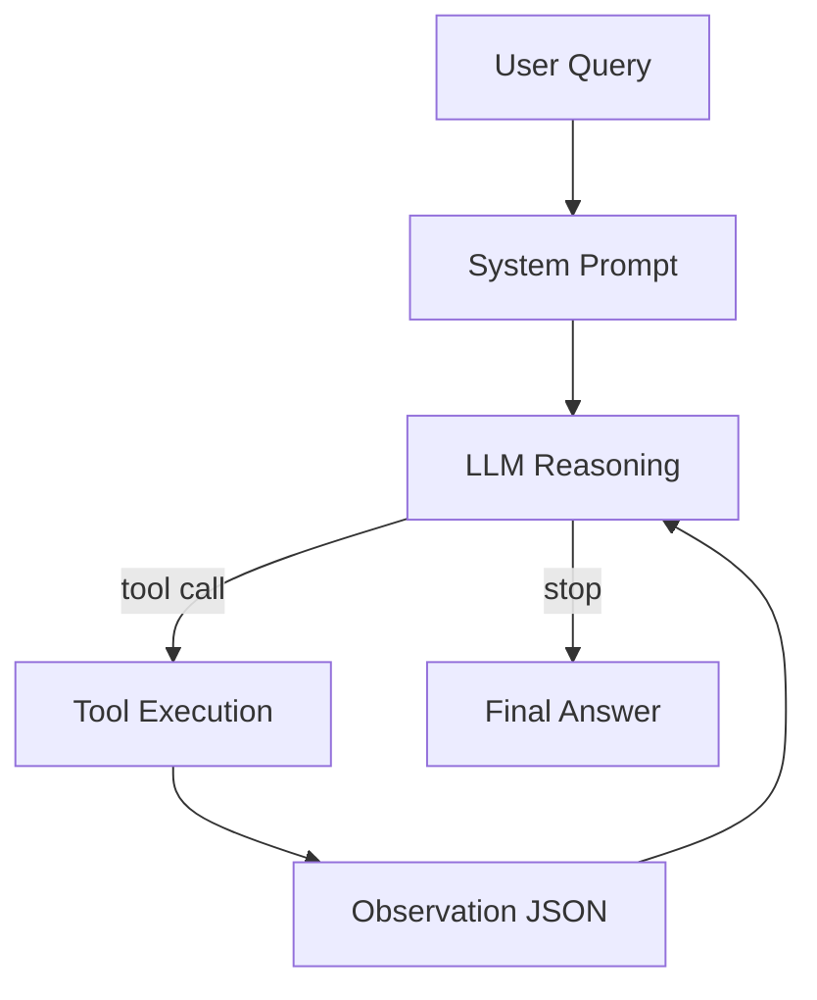

# Group Report: Lab 3 - Production-Grade Agentic System

- **Team Name**: Team10
- **Team Members**:
  1. Nguyễn Quốc Nam - Agent + UI/UX + `search_pc_price`
  2. Phạm Anh Dũng - 2A202600251 - `sort_products`
  3. Dương Quang Đông - `get_top_cpu_rankings`
  4. Nguyễn Lê Trung - 2A202600174 - `check_pc_compatibility` + tool structure refactor
  5. Vương Hoàng Giang - 2A202600349 - telemetry logging + benchmark testcase
- **Deployment Date**: 2026-04-06

---

## 1. Executive Summary

Nhóm xây dựng một hệ thống tư vấn PC gồm `baseline chatbot`, `agent_v1`, và `agent_v2`. Baseline chỉ dùng LLM nên phù hợp với câu hỏi tư vấn chung. Hai phiên bản agent dùng vòng lặp ReAct để gọi tool, đọc observation JSON, rồi mới trả lời.

- **Success Rate**: `100%` trên `6` test case cho `agent_v2`
- **Key Outcome**: Agent v2 giải quyết tốt hơn chatbot ở các bài toán multi-step và data-grounded như tìm giá mock, sort theo giá, kiểm tra compatibility, và top CPU; baseline chỉ thắng ở câu hỏi tư vấn chung không cần tool

---

## 2. System Architecture & Tooling

### 2.1 ReAct Loop Implementation

Agent được triển khai trong `src/agent/agent.py` theo chu trình:



Luồng này giúp model không phải "đoán" dữ liệu giá hay xếp hạng CPU, mà ra quyết định gọi tool trước rồi mới tổng hợp câu trả lời.

### 2.2 Tool Definitions (Inventory)

| Tool Name | Input Format | Use Case |
| :--- | :--- | :--- |
| `search_pc_price` | `{"query": str, "max_results": int}` | Tìm danh sách PC, laptop, RAM, VGA theo mock data |
| `sort_products` | `{"query": str, "sort_order": "asc"|"desc", "max_results": int}` | Sắp xếp danh sách sản phẩm theo giá |
| `check_pc_compatibility` | `{"cpu": str, "motherboard": str, "ram"?: str, "gpu"?: str, "psu"?: str, "case"?: str}` | Kiểm tra socket CPU-mainboard, chuẩn RAM, GPU-PSU, form factor case |
| `get_top_cpu_rankings` | `{"limit": int, "brand": "all"|"AMD"|"Intel"}` | Trả top CPU mạnh nhất hiện tại từ mock ranking data |

### 2.3 LLM Providers Used

- **Primary**: `gpt-4o`
- **Secondary (Backup)**: `Gemini` và `LocalProvider (Phi-3 GGUF)` đã được chuẩn bị trong codebase nhưng không dùng trong benchmark cuối

---

## 3. Telemetry & Performance Dashboard

Benchmark được chạy lại bằng:

```bash
python scripts/evaluate_chatbot_vs_agent.py
```

Artifacts được sinh ra ở:

- `report/group_report/artifacts/evaluation_cases.json`
- `report/group_report/artifacts/evaluation_results.json`
- `report/group_report/artifacts/evaluation_summary.md`

Số liệu cuối cùng:

- **Average Latency (P50)**: `2380.07ms` cho baseline, `3411.73ms` cho agent_v1, `2789.23ms` cho agent_v2
- **Max Latency (P99)**: `4359.31ms` cho baseline, `3797.09ms` cho agent_v1, `3663.68ms` cho agent_v2
- **Average Tokens per Task**: `230.83` cho baseline, `1163.33` cho agent_v1, `1882.17` cho agent_v2
- **Total Cost of Test Suite**: benchmark dùng normalized cost `${0.01}/1K tokens`, tổng cost là `$0.0138` cho baseline, `$0.0698` cho agent_v1, `$0.1129` cho agent_v2

Bộ test case cuối cùng gồm 6 case theo đúng tinh thần hướng dẫn môn học:

- 1 case tìm giá sản phẩm cụ thể trong hệ thống mock
- 1 case sort theo giá
- 1 case compatibility nhiều linh kiện
- 2 case top CPU hiện tại
- 1 case tư vấn mở để so sánh khi tool không cần thiết

Các case được lưu trong `report/group_report/artifacts/evaluation_cases.json` để có thể chạy lại trực tiếp.

---

## 4. Root Cause Analysis (RCA) - Failure Traces

### Case Study: Missing Specialized Tool for CPU Ranking

- **Input**: `Lấy top CPU mạnh nhất hiện nay và nêu 3 cái đầu.`
- **Observation**: Agent v1 không có `get_top_cpu_rankings`, nên model tự suy luận ra danh sách kiểu `Ryzen 9 7950X3D`, `Core i9-13900KS`, `Ryzen 9 7950X`, không khớp mock ranking của hệ thống. Baseline cũng thất bại theo cùng kiểu, chỉ là không có tool nào để grounding.
- **Root Cause**: Phiên bản v1 thiếu tool chuyên biệt cho loại truy vấn ranking, nên prompt dù có tốt hơn baseline vẫn không đủ để chống hallucination ở bài toán cần dữ liệu hiện tại.

Ngoài ra, trong quá trình benchmark nhóm còn phát hiện một lỗi khác: query `PC gaming RTX 4070` ban đầu bị route nhầm sang dataset VGA do keyword `RTX` được ưu tiên trước keyword `PC gaming`. Lỗi này đã được sửa ở `src/agent/tools/common.py`.

---

## 5. Ablation Studies & Experiments

### Experiment 1: Prompt v1 vs Prompt v2

- **Diff**: `agent_v1` dùng prompt ngắn và không có tool `get_top_cpu_rankings`; `agent_v2` dùng prompt hoàn chỉnh hơn, có thêm tool ranking CPU, và sửa bug route dataset cho truy vấn PC gaming
- **Result**: Success rate tăng từ `66.67%` lên `100%` trên 6 test case benchmark

### Experiment 2 (Bonus): Chatbot vs Agent

| Case | Chatbot Result | Agent Result | Winner |
| :--- | :--- | :--- | :--- |
| Giá PC gaming RTX 4070 | Không đưa được giá trong hệ thống | Trả đúng giá `32.990.000 đ`, shop `GeForce.vn` | **Agent** |
| Sort card RTX giảm dần | Không có bằng chứng sort theo mock data | Dùng `sort_products`, trả đúng `RTX 4080` trước `RTX 4070` | **Agent** |
| Kiểm tra compatibility | Trả lời thiếu grounding | Dùng `check_pc_compatibility`, nêu rõ `AM5` vs `LGA1700`, `DDR5` vs `DDR4` | **Agent** |
| Top CPU hiện tại | Hallucinate danh sách cũ | Dùng `get_top_cpu_rankings`, grounded theo mock ranking | **Agent** |
| Tư vấn build gaming tầm trung | Correct | Correct | Draw |

---

## 6. Production Readiness Review

- **Security**: Cần thêm input validation cho `limit`, `brand`, `sort_order`, và các chuỗi mô tả linh kiện trước khi đưa vào tool
- **Guardrails**: Agent đã có `max_iterations=5`, tránh loop vô hạn và giới hạn chi phí
- **Scaling**: Code đã được refactor từ file tool đơn sang package `src/agent/tools/`, giúp dễ thêm tool mới, test unit, và thay mock data bằng API thật trong tương lai

---

> [!NOTE]
> Submit this report by renaming it to `GROUP_REPORT_[TEAM_NAME].md` and placing it in this folder.
